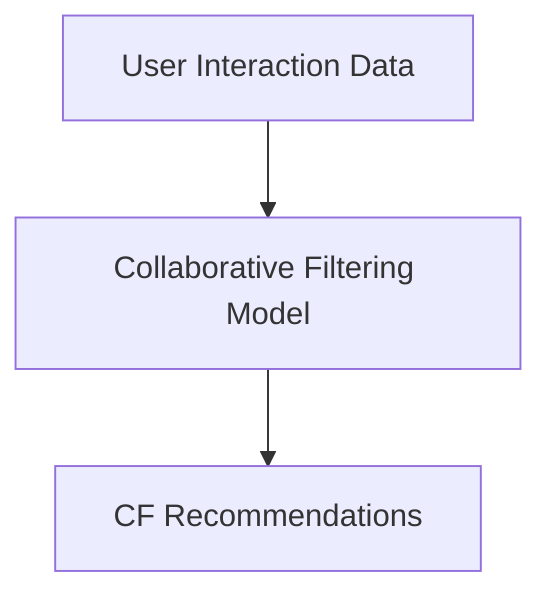
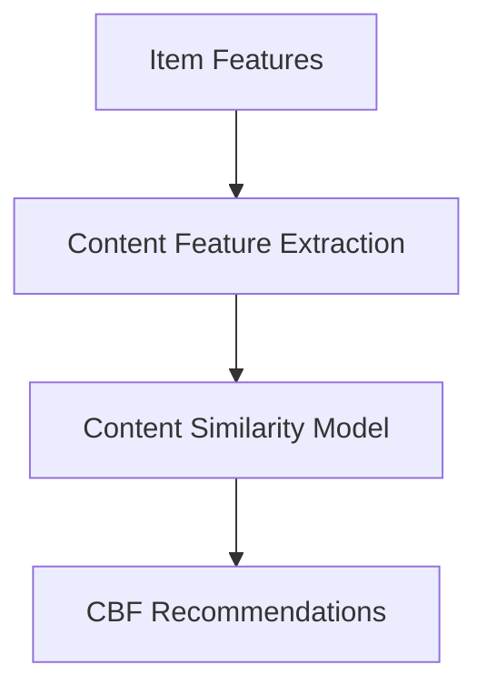
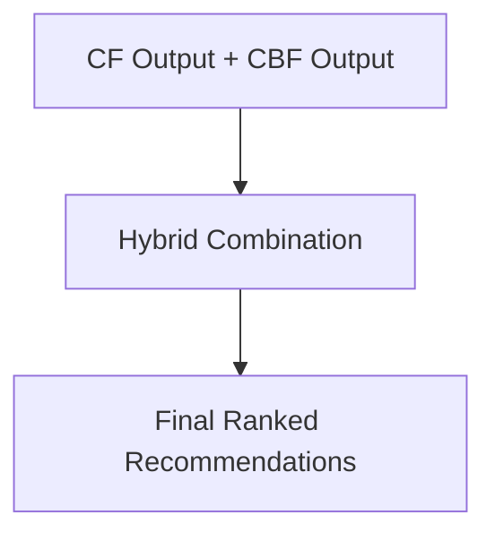

# Hybrid Recommendation: Combining Collaborative & Content-Based Filtering

A high-performance recommendation engine that leverages the strengths of both Content-Based Filtering (CBF) and Collaborative Filtering (CF) to provide accurate, personalized suggestions while mitigating common issues like the "**Cold Start**" problem.

## Why Hybrid Systems?

Neither method alone performs perfectly.

| Problem       | Content-Based  | Collaborative |
| ------------- | -------------- | ------------- |
| Cold Start    | Good for users | Bad           |
| Data Sparsity | Moderate       | Bad           |
| New Items     | Good           | Bad           |
| Diversity     | Low            | High          |
| Scalability   | High           | Moderate      |

Hybrid systems combine both to balance their strengths.

## Key Goals

1. Improve recommendation accuracy
2. Reduce cold start issues
3. Increase diversity
4. Improve robustness

## System Architecture

A hybrid recommender typically consists of:

and,

These outputs are then combined by a hybridization layer:

## Hybridization Strategies

Hybrid systems can be implemented in several ways.

### Weighted Hybrid

It is the simplest method. Here, both systems produce scores that are combined using weights.

The final prediction score S for user u and item i is calculated as:

$$
S(u,i)=α⋅S_{collaboration​}(u,i)+(1−α)⋅S_{content}​(u,i)
$$

Where:

- $S_{collaboration}$​ is the score from the **collaborative filtering** model.
- $S_{content}$​ is the cosine similarity score from item features.
- $α$ is a hyperparameter (usually $0≤α≤1$) tuned to balance the models.

For example, if:

- $α$ = 0.7 → Collaborative dominates
- $α$ = 0.3 → Content dominates

### Switching Hybrid

The system dynamically chooses which recommender to use depending on the situation.

Example:

- If user has < 5 interactions  
    use **Content-Based**
- Else  
    use **Collaborative Filtering**

This approach helps mitigate the cold start problem.

### Mixed Hybrid

Both recommendation lists are shown together.

Example:

- Top picks for you
- Trending with similar tastes
- Because you liked X

Each section may come from different models.

### Cascade Hybrid

One model filters candidates while another refines the ranking.

Example pipeline:

- Step 1: Collaborative filtering → retrieve candidate items
- Step 2: Content-based ranking → refine recommendations

Used in large-scale industrial recommender systems.

### Feature Augmentation

Output from one recommender becomes input features for another model.

Example:

- CF embeddings → used as features in a neural recommender

This approach is commonly used in deep learning recommenders.

## Pros and Cons

### Pros

1. Reduces cold start problems.
2. Improves recommendation quality.
3. Balances personalization and discovery.
4. More robust than single models.

### Cons

1. Increased system complexity.
2. Requires more computation.
3. Difficult hyperparameter tuning
4. Requires both interaction and feature data.

## Advanced Approaches

- Deep learning hybrid recommenders.
- Graph neural network recommenders.
- Context-aware recommendation systems.
- Reinforcement learning recommenders.
