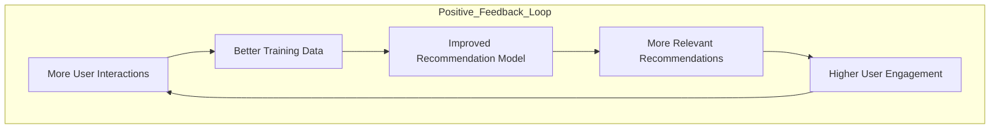
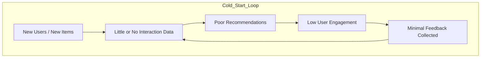

# The Cold Start Problem in Recommendation Systems

A comprehensive reference for understanding, diagnosing, and solving cold start challenges in modern recommender systems.

---

- [The Cold Start Problem in Recommendation Systems](#the-cold-start-problem-in-recommendation-systems)
  - [1. What is the Cold Start Problem?](#1-what-is-the-cold-start-problem)
    - [The Core Tension](#the-core-tension)
  - [2. Types of Cold Start](#2-types-of-cold-start)
    - [2.1 New User Cold Start](#21-new-user-cold-start)
    - [2.2 New Item Cold Start](#22-new-item-cold-start)
    - [2.3 New System (Pure) Cold Start](#23-new-system-pure-cold-start)
    - [2.4 Returning User with Sparse History (Grey Sheep)](#24-returning-user-with-sparse-history-grey-sheep)
  - [3. Why Cold Start Happens](#3-why-cold-start-happens)
    - [3.1 The Interaction Sparsity Root Cause](#31-the-interaction-sparsity-root-cause)
    - [3.2 The Bootstrap Paradox](#32-the-bootstrap-paradox)
    - [3.3 Data Collection Latency](#33-data-collection-latency)
    - [3.4 Implicit vs. Explicit Feedback Gap](#34-implicit-vs-explicit-feedback-gap)
  - [4. Impact on Different Recommendation Paradigms](#4-impact-on-different-recommendation-paradigms)
  - [5. Metrics Affected by Cold Start](#5-metrics-affected-by-cold-start)
    - [Recommendation Quality Metrics](#recommendation-quality-metrics)
    - [Business Metrics](#business-metrics)
    - [Fairness Metrics](#fairness-metrics)
  - [6. Solutions: New User Cold Start](#6-solutions-new-user-cold-start)
    - [6.1 Onboarding / Preference Elicitation](#61-onboarding--preference-elicitation)
    - [6.2 Demographic-Based Recommendations](#62-demographic-based-recommendations)
    - [6.3 Popularity-Based Fallback](#63-popularity-based-fallback)
    - [6.4 Social Graph Bootstrapping](#64-social-graph-bootstrapping)
    - [6.5 Cross-Domain / Cross-Platform Transfer](#65-cross-domain--cross-platform-transfer)
    - [6.6 Active Learning / Exploration Strategies](#66-active-learning--exploration-strategies)
    - [6.7 Meta-Learning (Learning to Learn)](#67-meta-learning-learning-to-learn)
  - [7. Solutions: New Item Cold Start](#7-solutions-new-item-cold-start)
    - [7.1 Content-Based Bootstrapping](#71-content-based-bootstrapping)
    - [7.2 Item Attribute-Based Latent Factor Initialization](#72-item-attribute-based-latent-factor-initialization)
    - [7.3 Exploration via Forced Exposure](#73-exploration-via-forced-exposure)
    - [7.4 Zero-Shot / Few-Shot Recommendation](#74-zero-shot--few-shot-recommendation)
    - [7.5 Knowledge Graph Enrichment](#75-knowledge-graph-enrichment)
    - [7.6 Generative Item Augmentation](#76-generative-item-augmentation)
  - [8. Solutions: New System Cold Start](#8-solutions-new-system-cold-start)
    - [8.1 Expert Curation](#81-expert-curation)
    - [8.2 Data Import / Migration](#82-data-import--migration)
    - [8.3 Synthetic Data Generation](#83-synthetic-data-generation)
    - [8.4 Phased Launch Strategy](#84-phased-launch-strategy)
  - [9. Hybrid and Advanced Approaches](#9-hybrid-and-advanced-approaches)
    - [9.1 Hybrid Recommender Systems](#91-hybrid-recommender-systems)
    - [9.2 Warm-Up Acceleration](#92-warm-up-acceleration)
    - [9.3 Bayesian Approaches](#93-bayesian-approaches)
    - [9.4 Graph Neural Networks (GNNs)](#94-graph-neural-networks-gnns)
  - [10. Deep Learning Approaches](#10-deep-learning-approaches)
    - [10.1 Neural Collaborative Filtering (NCF)](#101-neural-collaborative-filtering-ncf)
    - [10.2 DropoutNet](#102-dropoutnet)
    - [10.3 Variational Autoencoders (VAE) for Cold Start](#103-variational-autoencoders-vae-for-cold-start)
    - [10.4 Attention Mechanisms for Context](#104-attention-mechanisms-for-context)
  - [11. LLMs and Foundation Models for Cold Start](#11-llms-and-foundation-models-for-cold-start)
    - [11.1 LLMs as Zero-Shot Recommenders](#111-llms-as-zero-shot-recommenders)
    - [11.2 LLM-Generated User Profiles](#112-llm-generated-user-profiles)
    - [11.3 Embedding Alignment](#113-embedding-alignment)
    - [11.4 LLM-Augmented Item Features](#114-llm-augmented-item-features)
  - [12. Industry Case Studies](#12-industry-case-studies)
    - [12.1 Netflix](#121-netflix)
    - [12.2 Spotify](#122-spotify)
    - [12.3 Amazon](#123-amazon)
    - [12.4 TikTok](#124-tiktok)
  - [13. Cold Start in Different Domains](#13-cold-start-in-different-domains)
    - [13.1 E-Commerce](#131-e-commerce)
    - [13.2 News / Content Recommendation](#132-news--content-recommendation)
    - [13.3 Music Streaming](#133-music-streaming)
    - [13.4 Job / Talent Platforms](#134-job--talent-platforms)
    - [13.5 Healthcare / Medical](#135-healthcare--medical)
  - [14. Evaluation Protocols for Cold Start](#14-evaluation-protocols-for-cold-start)
    - [14.1 Cold Start Test Split](#141-cold-start-test-split)
    - [14.2 Temporal Split for New Items](#142-temporal-split-for-new-items)
    - [14.3 N-Shot Evaluation](#143-n-shot-evaluation)
    - [14.4 Metrics to Track](#144-metrics-to-track)
  - [15. Common Pitfalls and Misconceptions](#15-common-pitfalls-and-misconceptions)
    - ["Just use popularity as a cold start fallback — it's good enough"](#just-use-popularity-as-a-cold-start-fallback--its-good-enough)
    - ["Our system doesn't have a cold start problem because we collect enough data"](#our-system-doesnt-have-a-cold-start-problem-because-we-collect-enough-data)
    - ["Content-based filtering fully solves item cold start"](#content-based-filtering-fully-solves-item-cold-start)
    - ["Adding more user features at signup solves new user cold start"](#adding-more-user-features-at-signup-solves-new-user-cold-start)
    - ["Cold start is a training problem — just train on more data"](#cold-start-is-a-training-problem--just-train-on-more-data)
    - ["One cold start solution fits all cases"](#one-cold-start-solution-fits-all-cases)
  - [16. Research Directions and Open Problems](#16-research-directions-and-open-problems)
    - [16.1 Universal User Representations](#161-universal-user-representations)
    - [16.2 Few-Shot Recommendation](#162-few-shot-recommendation)
    - [16.3 Causal Cold Start](#163-causal-cold-start)
    - [16.4 Cold Start with LLMs at Scale](#164-cold-start-with-llms-at-scale)
    - [16.5 Dynamic Cold Start Thresholds](#165-dynamic-cold-start-thresholds)
    - [16.6 Cold Start in Sequential / Session-Based Models](#166-cold-start-in-sequential--session-based-models)
  - [Summary](#summary)

---

## 1. What is the Cold Start Problem?

The **cold start problem** refers to the inability of a recommendation system to draw meaningful inferences for users or items that have little to no historical interaction data. Since most classical recommenders (especially collaborative filtering) rely on a rich matrix of past interactions (ratings, clicks, purchases, views), entities with sparse or zero history create a fundamental data insufficiency.

The term is borrowed from engineering, just as a cold engine needs time to warm up before performing optimally, a recommendation system needs a sufficient "warm-up" period of data collection before it can make confident predictions.

### The Core Tension





This feedback loop means cold start is not merely a technical inconvenience — it is a **business-critical problem** that directly impacts user retention, item discoverability, and revenue.

---

## 2. Types of Cold Start

There are three canonical cold start scenarios, each with its own characteristics and mitigation strategies.

### 2.1 New User Cold Start

A **new user** joins the platform with zero or very few interactions. The system has no personalization signal and cannot distinguish this user from any other new user.

**Characteristics:**

- No interaction history (ratings, clicks, views, purchases)
- No implicit signals (time spent, scroll depth, search queries)
- Demographic or profile data may or may not be available
- Users at highest churn risk — poor early experience drives them away permanently

**Example:**  
A new user signs up on Netflix. The system has no viewing history. It cannot know if they prefer action movies or documentaries, or if they enjoy foreign films.

---

### 2.2 New Item Cold Start

A **new item** (product, movie, song, article) is added to the catalog with no interaction history. Collaborative filtering cannot recommend it because no user has rated or interacted with it.

**Characteristics:**

- Item exists in the catalog but has zero or very few ratings/interactions
- May have rich metadata (description, genre, price, author, tags)
- Creates a **discoverability problem** — good items may never surface
- Economically critical: new product launches depend on early exposure

**Example:**  
A newly published book on Amazon has no reviews. Standard collaborative filtering will never recommend it, creating a vicious cycle where obscure items remain obscure.

---

### 2.3 New System (Pure) Cold Start

A **new system** has no users, no items, and no interactions. This is the bootstrapping problem faced when launching a recommendation platform from scratch.

**Characteristics:**

- The entire interaction matrix is empty or near-empty
- No historical data to learn from at all
- Often underestimated in system design
- Requires fundamentally different strategies than the above two

**Example:**  
A startup launches a new e-commerce platform. No purchase history exists. Every user is a new user, and every product is a new item simultaneously.

---

### 2.4 Returning User with Sparse History (Grey Sheep)

A related but often conflated issue: users with very few interactions who don't fit neatly into any behavioral cluster. Sometimes called the **grey sheep problem**.

**Characteristics:**

- Has _some_ data, but not enough for confident prediction
- May have highly idiosyncratic tastes not matching any cluster
- Collaborative filtering struggles to find reliable neighbors

---

## 3. Why Cold Start Happens

Understanding the root causes helps in designing principled solutions.

### 3.1 The Interaction Sparsity Root Cause

Most real-world interaction matrices are **extremely sparse**. A typical e-commerce platform may have:

- Millions of users
- Millions of products
- But each user interacts with only ~0.01–0.1% of the catalog

This makes it statistically impossible to generalize from zero interactions.

### 3.2 The Bootstrap Paradox

To get good recommendations, users must interact. To interact meaningfully, users need good recommendations. This circular dependency is the core of the cold start problem.

### 3.3 Data Collection Latency

Even when interactions do happen, there is often a delay before data is ingested, processed, and incorporated into the model. Real-time systems mitigate but don't eliminate this.

### 3.4 Implicit vs. Explicit Feedback Gap

Explicit feedback (ratings) is rare. Most systems rely on implicit feedback (clicks, views), which is noisy and context-dependent. A new user generates neither initially.

---

## 4. Impact on Different Recommendation Paradigms

| Paradigm                                | Cold Start Sensitivity | Reason                                                |
| --------------------------------------- | ---------------------- | ----------------------------------------------------- |
| **Collaborative Filtering (User-User)** | Very High              | Requires interaction history to find similar users    |
| **Collaborative Filtering (Item-Item)** | High                   | Requires items to have been rated by common users     |
| **Matrix Factorization (MF)**           | Very High              | Latent factors cannot be learned without interactions |
| **Content-Based Filtering**             | Low                    | Uses item/user attributes, not interactions           |
| **Knowledge-Based**                     | Very Low               | Uses explicit constraints and domain rules            |
| **Hybrid Systems**                      | Medium                 | Depends on how components are combined                |
| **Deep Learning (NCF, etc.)**           | High                   | Embedding-based, still needs interaction signal       |
| **Session-Based**                       | Low-Medium             | Can work within a single session without history      |

---

## 5. Metrics Affected by Cold Start

Cold start degrades several key evaluation and business metrics:

### Recommendation Quality Metrics

- **Precision@K / Recall@K** — Drop significantly for cold users/items
- **NDCG (Normalized Discounted Cumulative Gain)** — Ranking quality suffers without personalization
- **Hit Rate** — Lower probability of recommending relevant items
- **Coverage** — New items never appear → catalog coverage drops

### Business Metrics

- **User Retention (Day 1, Day 7, Day 30)** — Highest churn happens early
- **Click-Through Rate (CTR)** — Poor early recommendations reduce engagement
- **Revenue** — New items miss peak launch windows
- **Long-Tail Discovery** — Cold items rarely surface, harming diversity

### Fairness Metrics

- **Exposure Fairness** — New items get zero exposure vs. popular items
- **Popularity Bias Amplification** — Systems over-recommend already-popular items to fill cold gaps

---

## 6. Solutions: New User Cold Start

### 6.1 Onboarding / Preference Elicitation

Ask users directly about their preferences during signup.

**Strategies:**

- **Explicit rating of sample items** — Show a curated set of popular/diverse items and ask for ratings
- **Genre/category selection** — Let users select interest areas
- **Preference questionnaires** — Structured surveys (risk: user drop-off)
- **Taste profile wizards** — Interactive UI flows (e.g., Spotify's genre picker at signup)

**Trade-off:** More questions → better cold start coverage, but higher friction and lower completion rates. Aim for **3–7 questions maximum**.

---

### 6.2 Demographic-Based Recommendations

Use available user attributes (age, location, device type, referral source) to bootstrap recommendations.

**Approach:**

1. Segment existing users by demographic profiles
2. Compute average preferences per segment
3. Assign new users to segments and use segment-level recommendations

**Limitations:** Coarse-grained; risks demographic stereotyping; requires demographic data (privacy concerns).

---

### 6.3 Popularity-Based Fallback

Recommend globally popular or trending items as a baseline.

**Variants:**

- **Global popularity** — Top-N most interacted items overall
- **Category popularity** — Top items within each category
- **Trending** — Items with high recent velocity (rising popularity)
- **Contextual popularity** — Popular items for users similar in context (time of day, location)

**When to use:** As a fallback when no other signal exists. Always combine with other strategies.

**Limitation:** Amplifies popularity bias; poor for long-tail discoverability.

---

### 6.4 Social Graph Bootstrapping

If the platform has social features, use the new user's social connections to bootstrap recommendations.

**Approach:**

- If user A follows/friends user B who is already warm, borrow B's preference profile
- Weighted average of friends' interaction histories

**Used by:** Facebook, Twitter, LinkedIn recommenders.

**Limitation:** Requires social graph; not all platforms have social features.

---

### 6.5 Cross-Domain / Cross-Platform Transfer

Leverage the user's history from other platforms or domains to bootstrap preferences.

**Example:** A new Spotify user who logged in via Facebook can have their music taste inferred from Facebook activity.

**Approaches:**

- **OAuth/SSO signals** — What platforms does the user use?
- **Cross-domain embedding transfer** — Transfer latent factors from one domain to another
- **Federated learning** — Learn user profiles across platforms without sharing raw data

**Limitation:** Privacy regulations (GDPR, CCPA); user consent required; domain gap issues.

---

### 6.6 Active Learning / Exploration Strategies

Intelligently select items to show new users to maximize information gain.

**Strategies:**

- **Uncertainty Sampling** — Show items where the model is most uncertain about user preference
- **Entropy-based exploration** — Maximize information entropy reduction
- **Bandit Algorithms** — Treat recommendation as an exploration-exploitation problem

**Bandit approaches:**

- `ε-greedy`: With probability ε, recommend a random item; otherwise recommend best known
- `UCB (Upper Confidence Bound)`: Balance exploration and exploitation based on confidence intervals
- `Thompson Sampling`: Bayesian approach — sample from posterior distributions over rewards

---

### 6.7 Meta-Learning (Learning to Learn)

Train a model that can quickly adapt to a new user's preferences with only a few interactions.

**Key approaches:**

- **MAML (Model-Agnostic Meta-Learning)** — Learn an initialization that can be fine-tuned with K gradient steps
- **Prototypical Networks** — Map users to a prototype space; new users are placed relative to known prototypes
- **MeLU** — Meta-learning for user cold start in recommender systems (He et al., 2020)

**Intuition:** Instead of learning preferences for known users, learn _how to learn preferences quickly_ for any new user.

---

## 7. Solutions: New Item Cold Start

### 7.1 Content-Based Bootstrapping

Use item metadata/attributes to recommend new items to users whose past interactions match those attributes.

**Item features commonly used:**

- **Text** — Title, description, reviews → TF-IDF, BERT embeddings
- **Categorical** — Genre, category, brand, tags
- **Numerical** — Price, duration, year, ratings from other sources
- **Visual** — Product images, movie posters → CNN features
- **Audio** — Music → audio spectrograms, MFCCs

**Approach:**

1. Build item content embeddings
2. Match content similarity to user preference profiles
3. Surface new items that are content-similar to items the user liked

---

### 7.2 Item Attribute-Based Latent Factor Initialization

For MF-based models, initialize the latent embedding of a new item using its content features rather than random initialization.

```bash
new_item_embedding = f(item_attributes)
```

Where `f` is learned during training on warm items.

**Key idea:** Train a side-information encoder alongside the MF model, so that any item can get a meaningful embedding from its attributes alone.

**Models using this:** DropoutNet, HEATER, CLCRec.

---

### 7.3 Exploration via Forced Exposure

Intentionally inject new items into recommendation lists to collect early interaction data.

**Strategies:**

- **Random injection** — Show new items to a random sample of users
- **Targeted injection** — Show to users most likely to interact (based on content similarity)
- **Explore slots** — Reserve K slots in every recommendation list for exploration

**Trade-off:** Hurts short-term recommendation quality but accelerates item warm-up.

---

### 7.4 Zero-Shot / Few-Shot Recommendation

Recommend items with zero or very few interactions using only their content descriptions.

**LLM-based approach:**

```bash
Prompt: "The user has previously liked: [item A, item B, item C].
         Given a new item with description [X], would this user like it?
         Explain your reasoning."
```

**Embedding-based approach:** Use a universal embedding model (e.g., Sentence-BERT, CLIP) to embed both users and items in a shared semantic space.

---

### 7.5 Knowledge Graph Enrichment

Use a knowledge graph (KG) to connect new items to existing ones through semantic relationships.

**Example:** A new movie shares actors, directors, and genre with existing movies → these relationships provide recommendations pathways even before any user has watched it.

**Models:** KGCN, KGAT, RippleNet.

---

### 7.6 Generative Item Augmentation

Use generative models to synthetically create "fake" interaction data for new items based on similar warm items.

**Approach:**

1. Find content-similar warm items
2. Sample interaction patterns from those warm items
3. Use augmented interactions to initialize new item embeddings

---

## 8. Solutions: New System Cold Start

### 8.1 Expert Curation

Human editors manually curate recommendation lists before sufficient data is collected.

- Initial "staff picks" or "editorial selections"
- Domain expert input (music curators, film critics)
- Used by: early Spotify, Netflix, Amazon

**Limitation:** Doesn't scale; high cost; human bias.

---

### 8.2 Data Import / Migration

Import interaction data from external sources or predecessor systems.

- Import ratings from partner platforms (with consent)
- Use publicly available datasets as prior (e.g., MovieLens, Amazon reviews)
- Transfer model weights from a related domain

---

### 8.3 Synthetic Data Generation

Generate synthetic user-item interactions to bootstrap the system.

**Approaches:**

- **Rule-based simulation** — Define personas and simulate interaction patterns
- **GAN-based generation** — Train GANs to generate realistic interaction matrices
- **Collaborative cross-domain sampling** — Use distributions from similar mature platforms

**Risk:** Distribution mismatch between synthetic and real data.

---

### 8.4 Phased Launch Strategy

Instead of launching to everyone at once, launch to a subset of users to build up interaction data before wider rollout.

1. **Beta users** — Highly engaged early adopters
2. **Invite-only period** — Controlled growth
3. **Gradual rollout** — Expand as data density increases

---

## 9. Hybrid and Advanced Approaches

### 9.1 Hybrid Recommender Systems

Combine collaborative filtering with content-based filtering to handle cold start gracefully.

**Combination strategies:**

| Strategy                 | Description                              |
| ------------------------ | ---------------------------------------- |
| **Weighted hybrid**      | Linear combination of CF and CB scores   |
| **Switching hybrid**     | Use CB when cold, switch to CF when warm |
| **Feature augmentation** | Use CB features as input to CF model     |
| **Cascade hybrid**       | CB filters candidates, CF re-ranks them  |
| **Mixed hybrid**         | Display both CF and CB recommendations   |

**Switching hybrid is most practical for cold start:**

```bash
if user_interactions < threshold:
    recommend_using_content_based(user)
else:
    recommend_using_collaborative_filtering(user)
```

---

### 9.2 Warm-Up Acceleration

Track user "warmth" and continuously transition from cold to warm strategies.

```python
def get_warmth(user):
    """Returns value in [0, 1] representing how warm a user is."""
    interactions = get_interaction_count(user)
    return min(interactions / WARM_THRESHOLD, 1.0)

def recommend(user, candidates):
    w = get_warmth(user)
    cf_scores = collaborative_filter(user, candidates)
    cb_scores = content_based(user, candidates)
    return w * cf_scores + (1 - w) * cb_scores
```

---

### 9.3 Bayesian Approaches

Use Bayesian methods to maintain uncertainty estimates and incorporate priors.

**Key ideas:**

- Start with a prior distribution over user preferences (e.g., population average)
- Update posterior as new interactions arrive
- Recommendations reflect posterior uncertainty → naturally handles cold start

**Models:** Probabilistic Matrix Factorization (PMF), Bayesian Personalized Ranking (BPR) with priors.

---

### 9.4 Graph Neural Networks (GNNs)

Model users, items, and their relationships as a graph; propagate information across the graph to enrich cold entities.

**How GNNs help cold start:**

- A new user node connected to items via content similarity can receive information from similar warm users through graph propagation
- Multi-hop connections allow indirect preference signal transfer

**Models:** LightGCN, NGCF, PinSage, IGMC.

---

## 10. Deep Learning Approaches

### 10.1 Neural Collaborative Filtering (NCF)

**Problem:** Standard NCF embeddings are learned only from interactions — cold users/items have random embeddings.

**Fix:** Add side-information encoders:

```bash
user_embedding = MLP(user_features) + interaction_embedding
item_embedding = MLP(item_features) + interaction_embedding
```

The feature-based component provides a fallback when interaction embedding is absent.

---

### 10.2 DropoutNet

**Key idea:** During training, randomly drop the interaction history of some users/items, forcing the model to learn to rely on content features.

At inference time, cold users/items naturally fall into the "dropped" scenario the model was trained for.

**Result:** Model gracefully degrades to content-based behavior for cold entities.

---

### 10.3 Variational Autoencoders (VAE) for Cold Start

**CVAE-based approaches:**

- Encode user preferences into a latent distribution
- For cold users, infer the latent distribution from content features
- Sample from the latent space to generate recommendation scores

---

### 10.4 Attention Mechanisms for Context

Use attention over available context (session history, even within a single session) to generate temporary user representations.

**Session-based models:** GRU4Rec, SASRec, BERT4Rec can generate useful representations even from a single session, bypassing long-term history requirements.

---

## 11. LLMs and Foundation Models for Cold Start

Large Language Models offer powerful new tools for cold start due to their broad pre-trained knowledge.

### 11.1 LLMs as Zero-Shot Recommenders

```python
prompt = """
You are a movie recommendation system.
User preferences: [likes action, dislikes horror, enjoys sci-fi]
New movie: "Arrival" (2016) — linguistic sci-fi thriller about alien communication.
Should this be recommended to the user? Rate 1-10 and explain.
"""
```

LLMs can reason about item-user fit without any interaction data, purely from natural language descriptions.

### 11.2 LLM-Generated User Profiles

Use LLMs to infer rich user profiles from sparse signals:

- Purchase history text → inferred lifestyle, values, preferences
- Search query history → inferred intent and interests

### 11.3 Embedding Alignment

Use foundation model embeddings (e.g., text-embedding-ada-002, Sentence-BERT) to create a universal embedding space where:

- User queries and items share the same semantic space
- Cold items described in natural language can be directly compared to user preference embeddings

### 11.4 LLM-Augmented Item Features

Use LLMs to generate rich descriptive features for new items:

```bash
Input: "New product: Noise-cancelling headphones, $299, Bluetooth 5.0, 30hr battery"
Output: "Premium audio device targeting professionals and frequent travelers who value
         uninterrupted focus and long commutes..."
```

These richer descriptions improve content-based cold start performance significantly.

---

## 12. Industry Case Studies

### 12.1 Netflix

**Problem:** New movies/shows had no viewing history; new users had no preference signal.

**Solutions:**

- **Onboarding taste survey** — New users rate 3 titles they've seen
- **Content metadata embeddings** — Encode genre, cast, synopsis for new content
- **Trending recommendations** — Fallback for new users
- **A/B testing** — Continuous experimentation on cold start strategies

### 12.2 Spotify

**Problem:** New artists/songs had no play history; new users had no listening data.

**Solutions:**

- **Taste profile at signup** — Select favorite genres and artists
- **Audio feature embeddings** — Tempo, energy, danceability for new tracks (no listens needed)
- **Social graph** — Friend activity used to bootstrap new users
- **Discover Weekly** — Initially less personalized, refines over first few weeks

### 12.3 Amazon

**Problem:** Millions of new products listed daily; new users with no purchase history.

**Solutions:**

- **Content-based filtering** — Product descriptions, categories, attributes
- **Seller-provided data** — Rich product metadata at listing time
- **Cross-category transfer** — "Customers who bought X also bought Y" works across categories
- **Session-based signals** — What is the user browsing _right now_?

### 12.4 TikTok

**Problem:** New users have no watch history; new creators have no follower base.

**Solutions:**

- **Long play time as implicit feedback** — Even single long views create signal quickly
- **Device/OS signals** — Infer demographics from device type
- **Initial diverse feed** — Show a broad mix to quickly identify preferences
- **Creator onboarding** — New creators' first videos shown to a small diverse test audience

TikTok is widely regarded as having the industry's best cold start solution due to its ability to warm up new users in a single session.

---

## 13. Cold Start in Different Domains

### 13.1 E-Commerce

- High item turnover (seasonal products, flash sales) → constant new item cold start
- Rich product metadata (specifications, images, reviews from external sources)
- **Key strategy:** Use product attribute embeddings + bestseller injection

### 13.2 News / Content Recommendation

- Items (articles) have extremely short lifespans (hours to days)
- Content cold start is the norm, not the exception
- **Key strategy:** Real-time content embedding from article text + trending fallback

### 13.3 Music Streaming

- Long-tail problem: millions of songs, most with very few plays
- Rich audio features available (no play count needed for feature extraction)
- **Key strategy:** Audio fingerprint embeddings + genre/mood taxonomy

### 13.4 Job / Talent Platforms

- New job postings + new job seekers both cold
- Rich structured text available (job descriptions, resumes)
- **Key strategy:** NLP embeddings of job descriptions and candidate profiles

### 13.5 Healthcare / Medical

- New patients have no medical history in the system
- High-stakes: errors are costly
- **Key strategy:** Conservative content-based + demographic fallbacks; heavy emphasis on explicit preference elicitation

---

## 14. Evaluation Protocols for Cold Start

Standard evaluation protocols mask cold start performance. Use dedicated cold start evaluation setups.

### 14.1 Cold Start Test Split

```bash
1. Identify cold users/items: entities with < K interactions
2. Hold out ALL interactions for these cold entities as test set
3. Evaluate recommendation quality on this cold-only test set
```

### 14.2 Temporal Split for New Items

```bash
Train: Interactions up to time T
Test:  Items first appearing after time T (guaranteed new items)
```

This simulates the real-world scenario of recommending newly added items.

### 14.3 N-Shot Evaluation

Evaluate performance as a function of number of interactions:

```bash
0-shot: No interactions  → cold
1-shot: 1 interaction   → very cold
5-shot: 5 interactions  → semi-cold
10-shot: 10 interactions → approaching warm
```

Plot metrics vs. number of interactions to understand the warm-up curve.

### 14.4 Metrics to Track

- **Recall@K** segmented by user/item warmth
- **NDCG@K** for cold vs. warm segments
- **Coverage** — What fraction of cold items ever get recommended?
- **Time to warm** — How many interactions does a user/item need to reach warm performance?

---

## 15. Common Pitfalls and Misconceptions

### "Just use popularity as a cold start fallback — it's good enough"

**Reality:** Popularity recommendations are uncorrelated with individual preferences and amplify the rich-get-richer dynamic. They are a floor, not a solution.

### "Our system doesn't have a cold start problem because we collect enough data"

**Reality:** Every new user and every new item starts cold. The question is how _quickly_ you resolve it, not whether it exists.

### "Content-based filtering fully solves item cold start"

**Reality:** Content-based filtering is much better for cold items, but the quality of content features varies enormously. Poor metadata leads to poor CB recommendations.

### "Adding more user features at signup solves new user cold start"

**Reality:** Users often skip or lie on signup surveys. High-friction onboarding increases drop-off. The best solutions minimize friction while maximizing signal.

### "Cold start is a training problem — just train on more data"

**Reality:** No amount of training data helps when a genuinely new entity has never been seen. The problem is structural, not just a data size issue.

### "One cold start solution fits all cases"

**Reality:** New user, new item, and new system cold start require different strategies. A solution good for one may be irrelevant for another.

---

## 16. Research Directions and Open Problems

### 16.1 Universal User Representations

Can we learn a universal user embedding that transfers across platforms, preserving privacy? Federated learning + differential privacy are promising here.

### 16.2 Few-Shot Recommendation

Meta-learning approaches show promise, but generalizing to diverse domains with minimal task data remains open.

### 16.3 Causal Cold Start

Most cold start solutions are correlational. Causal approaches — asking "would this user like this item _if_ they were exposed?" — remain underexplored.

### 16.4 Cold Start with LLMs at Scale

LLMs show strong zero-shot recommendation ability, but inference latency and cost make real-time deployment at scale challenging.

### 16.5 Dynamic Cold Start Thresholds

Most systems use a fixed threshold for "warm" vs. "cold." Dynamic, per-domain, or per-user thresholds likely perform better but are harder to tune.

### 16.6 Cold Start in Sequential / Session-Based Models

How to handle cold start in purely session-based contexts where even session history is absent remains an active area.

---

## Summary

The cold start problem is one of the most practically important challenges in recommender systems. It has three main forms (new user, new item, new system), each requiring different mitigation strategies.

**The core principle:** when interaction data is absent, fall back to **content**, **context**, and **population-level signals** until sufficient personalization data accumulates. The best systems treat cold start not as a bug to be patched, but as a **first-class design constraint** built into the architecture, training, and evaluation pipeline from day one.

The goal is not to eliminate cold start, it cannot be eliminated. The goal is to make the cold phase as brief and painless as possible.
